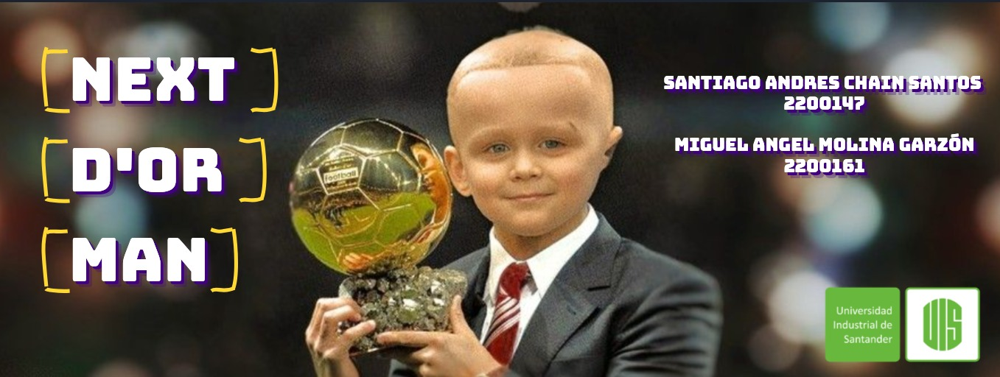

# Next_D'or_Man

# Integrantes
Santiago Andres Chain Santos, Miguel Angel Molina Garzon.
 # Objetivo
Predecir los próximos ganadores del Balón de Oro basándonos en las estadísticas del videojuego FIFA.
# Dataset 
El dataset está estructurado en formato tabular y contiene varias columnas que representan diferentes atributos, como nombres, edades, puntuaciones, etc. Los valores de estas columnas han sido creados y distribuidos por  EA Sports. 

Link:
https://www.kaggle.com/datasets/sanjeetsinghnaik/fifa-23-players-dataset 

# Modelos Usados 
GaussianNB, RandomForestClassifier, DecisionTreesClassifier, SVC y DecisionTreesRegressor.

# Notebook
Proyecto realizado en el entorno de Google Colab.

Enlace:
[Next D'Or Man Notebook](https://colab.research.google.com/drive/1lBuNs1zW6oBOgtVPOER1Tic1XXtxpnNp?usp=sharing)

# Video Explicativo
Video alojado en Youtube

Enlace: [Next D'Or Man Video](https://youtu.be/bzL1pLjQ6RE)

# Diapositivas 
Slides realizados para la exposicion del proyecto

Enlace:
[Next D'Or Man Slides](https://www.canva.com/design/DAFpM-NhL2A/Pa_kg3rD2vpHNOD7nb-TmQ/edit?utm_content=DAFpM-NhL2A&utm_campaign=designshare&utm_medium=link2&utm_source=sharebutton)
